# Actions in NOVA reporting

Stories: ACT-5460 (Actions data source), ACT-5461 (P0 reports), ACT-5469 (report library). Epic ACT-5278.

## 1. What is this
Actions (tickets) is now the fifth data source in NOVA Dashboards & Reports, turned on per tenant with one feature flag.

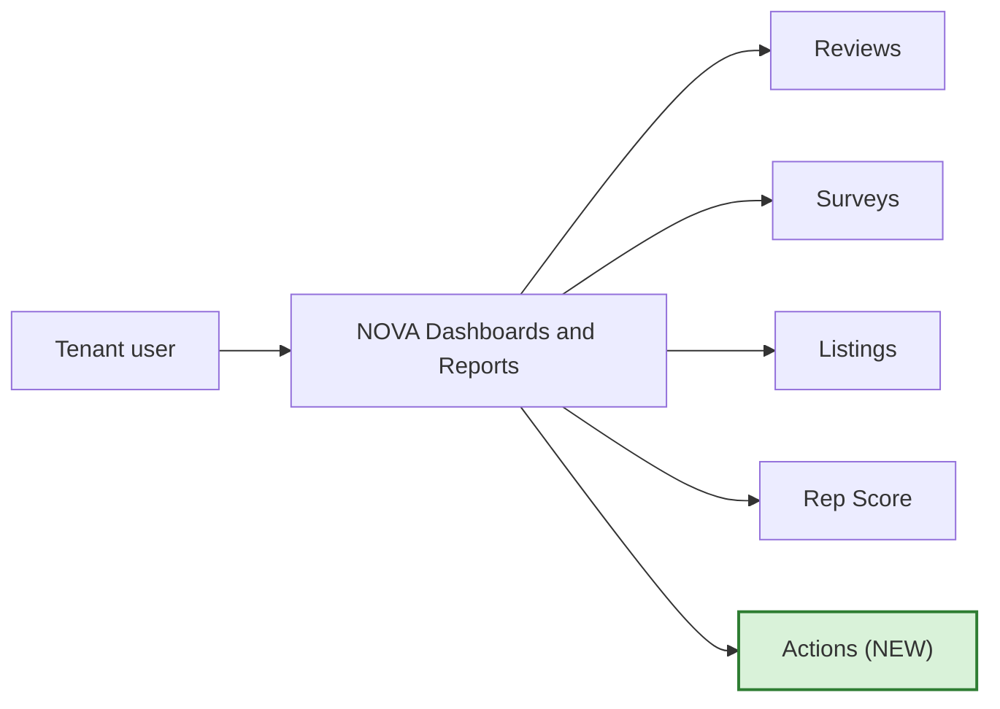

## 2. Why NOVA
One self-serve engine, builder and library for every source, instead of a separate fixed set of ticket reports.

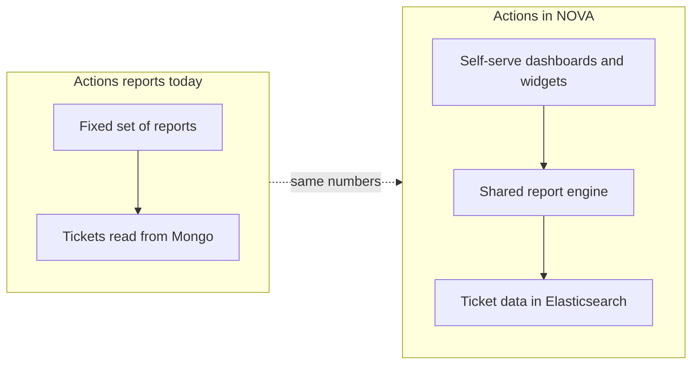

## 3. How it helps
Ticket numbers become self-serve dashboards next to Reviews and the other sources.

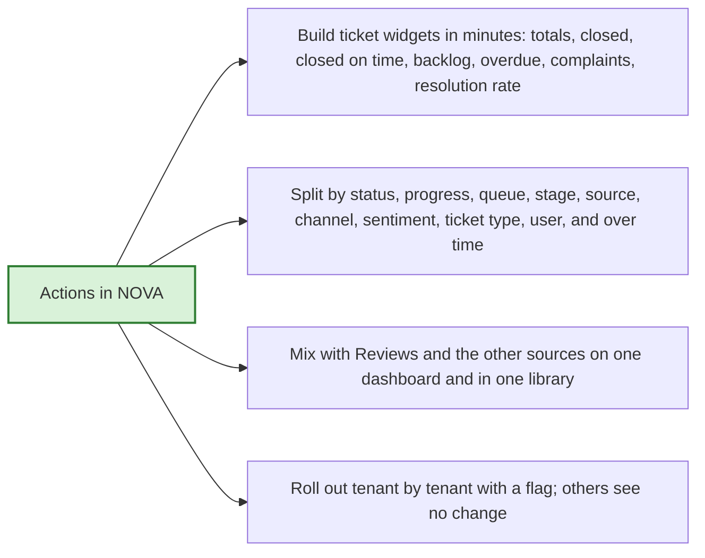

What the source offers:
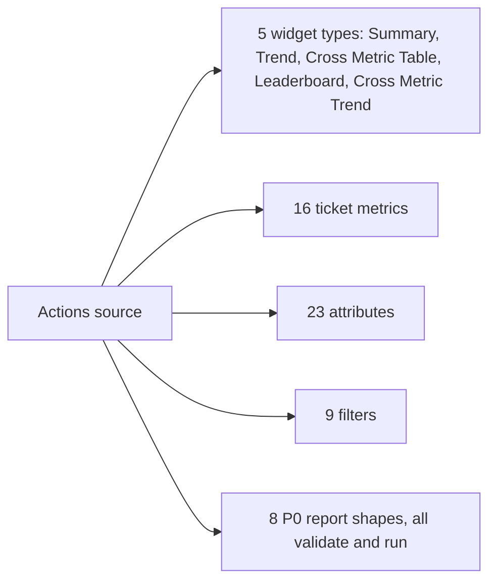

## 4. Who sees it
Three switches, all per tenant.

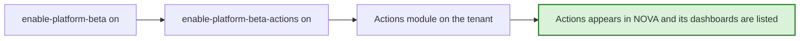

## 5. How it works
The report engine offers Actions only when the switches are on; the report library lists Actions dashboards only for flagged tenants.

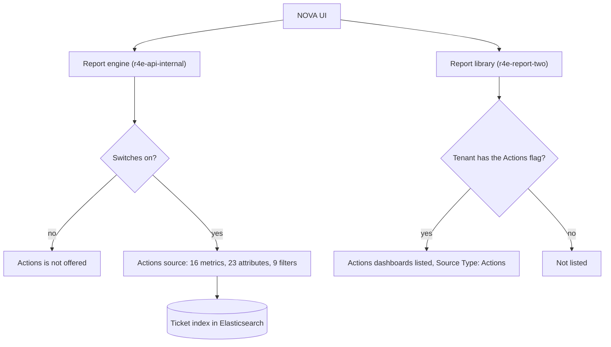

## 6. Where the ticket data comes from
Tickets flow into the Elasticsearch index through the pipeline; NOVA only reads the index. On QA the pipeline is not live yet, so the index has a few hand-loaded test tickets.

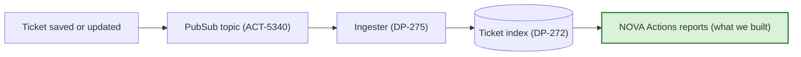

## 7. What we are covering
Everything runs on localhost against real QA data: tenant 1286, the saved dashboard "Actions-Demo", date = Calendar Year 2023.

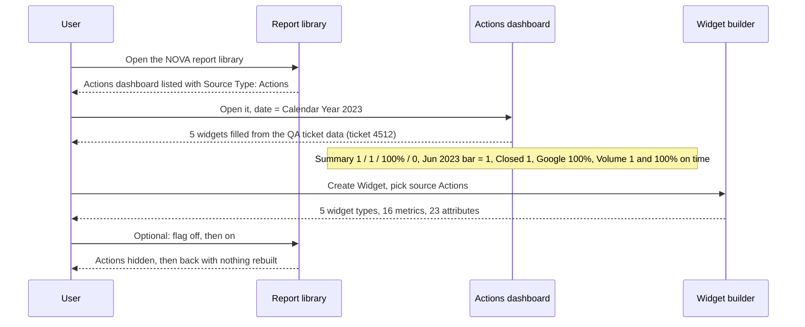

## 8. Status
Known engine issue below = group by plus metric sort returns a 500 from Elasticsearch; same on Reviews.

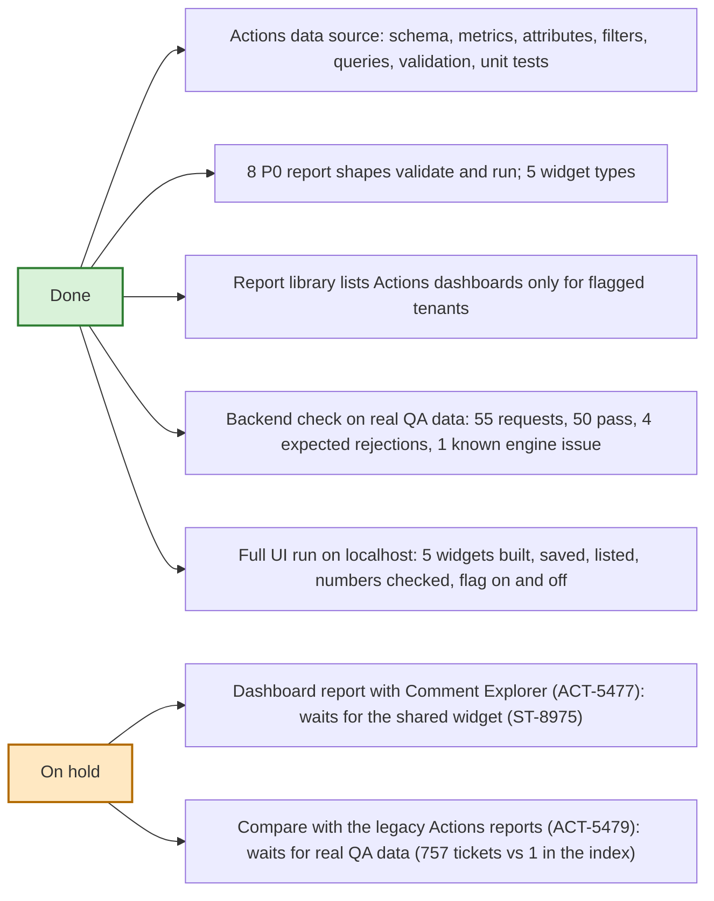

## 9. Points to be noted
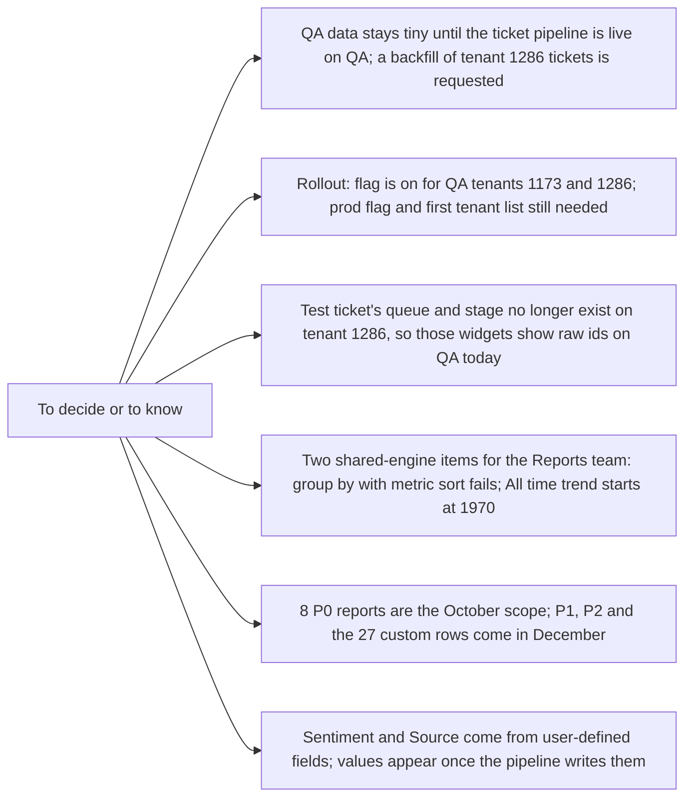

Suggestions from PMs:
- 
- 
- 

## 10. Real vs dummy data
Real ticket, real index, real report service code. Test-only: the flag and module on QA tenant 1286, and the backend on localhost instead of QA.

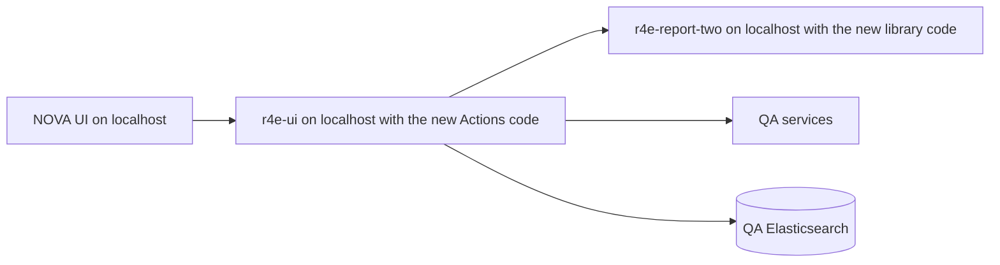
